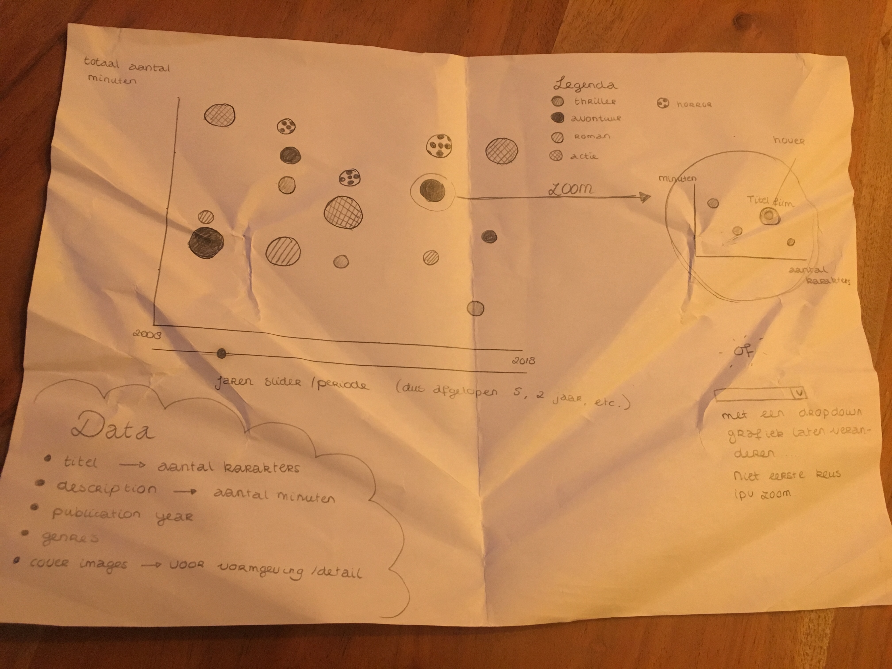
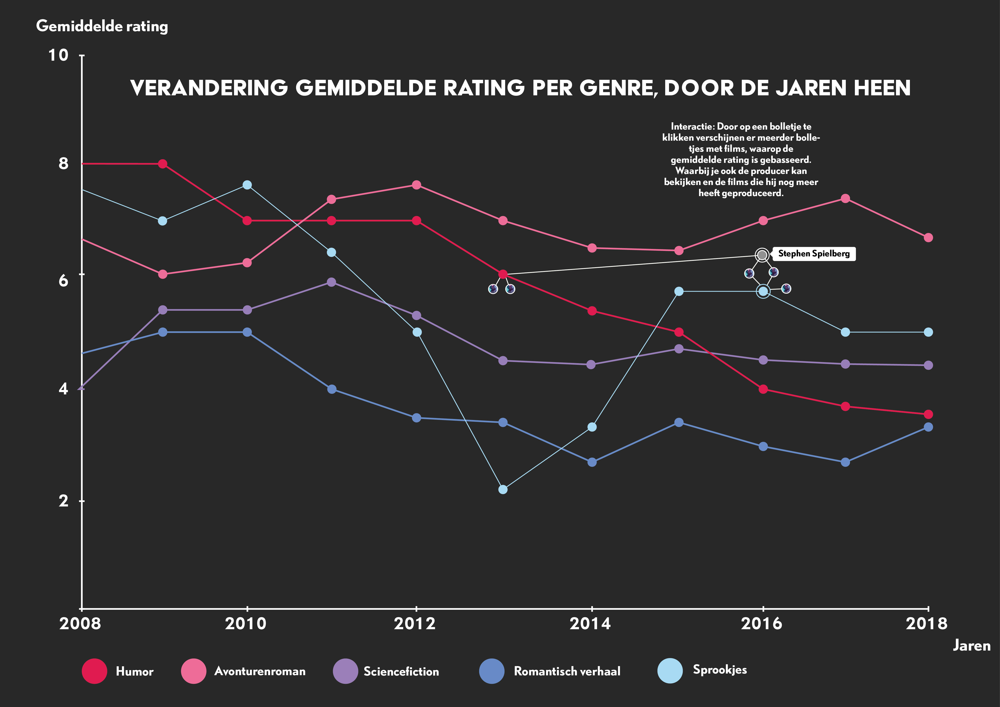
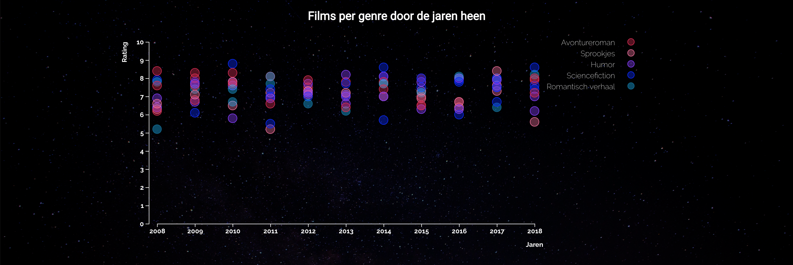
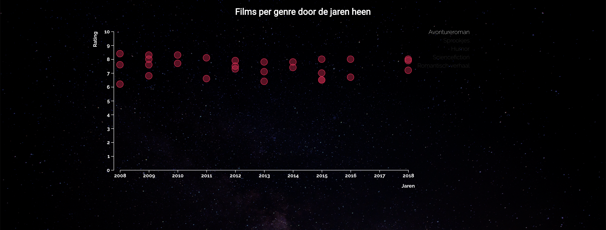
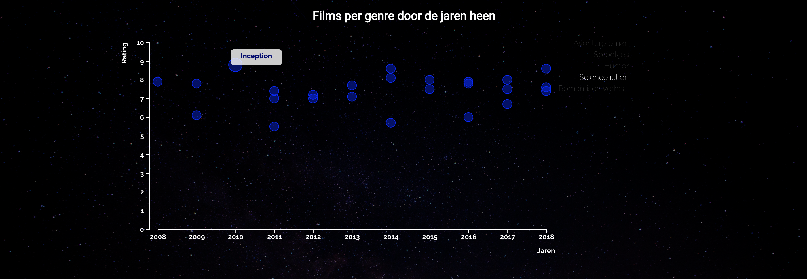
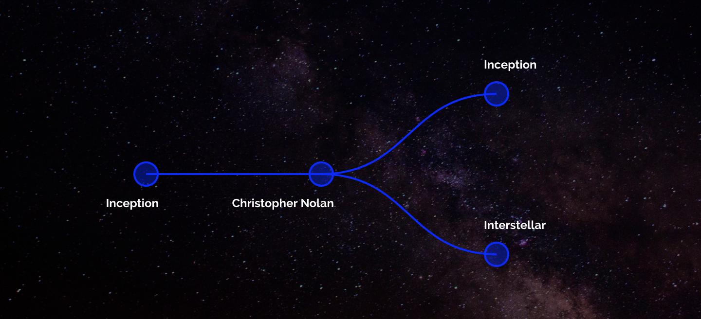
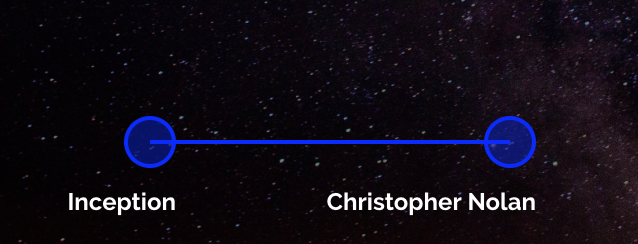
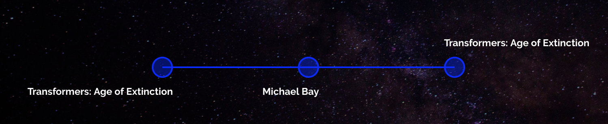
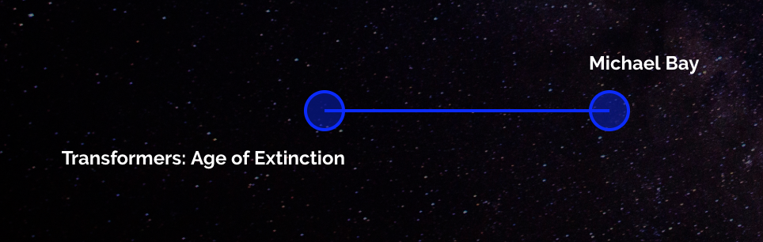

# Frontend Data

## Partner: Oba 
**In this project we had to build an data visualisation with D3. The most important part is making this data visualisation interactive and making sure it's meaningful. The data visualisation is based on data from the oba Api.**


## Table of Contents
* [How to install](#how-to-install) 
* [Oba Api](#the-data) 
* [Concept](#concept)
* [Final Product](#final-product)
* [Learning process](#learning-process)
* [Credits](#credits)
* [Resources](#resources)
* [Packages](#packages)
* [License](#license)

## How to install

Before installing make sure you have installed the latest version of node.js
Choose or make a new directory.
Load the template into your directory.
```bash
git clone https://github.com/chelseadoeleman/frontend-data.git
```

Make sure you have the latest version of npm.
Install the dependencies in [package.json](package.json)
```bash
npm install
```

Start the server 
```bash
npm start
```

## Oba Api

Another project with Oba, with the same dataset like [last time](https://github.com/chelseadoeleman/functional-programming). 
The variables I would like to take a look at are:

* All english movies
* Five genres
    * Humor
    * Avontureroman
    * Romantisch verhaal
    * Sciencefiction
    * Sprookjes
* The movies of the last ten years
* Duration of those movies. 

To get the data from the Oba api take a look at my other [repo](https://github.com/chelseadoeleman/functional-programming) because, I only used [helpers.js](./helpers/helpers.js) and [index.js](index.js) to get my data from the Api and isn't relevant to D3. 


## Concept

This time I decided not to do books, but movies. While Oba is a public library they also have a large assortiment of movies. 



My first concept was looking at the duration time per genre, to see if this would change over time and if there is a connection to the title length. But after a talk with my teacher and some fellow classmates, I decided this wasn't interesting enough to visualize. 

I want to focus on five genre's to visualize my data, to see if movies are getting better ratings with time and if it is dependable by genre. Ratings are not included within the Api, so I have to connect another dataset to it. Imdb has a large assortiment of movies and valid ratings. 



After another presentation, this might be a tad bit too difficult for me to realize. So I had to make some design decisions. In the end I decided to only pick 10 movies per year. And to visualize every movie seperate, because when calculating an average all the movies might be ending up on the same line. And then the difference between genre's wouldn't be really shown. 

## Final Product


I will guide you by step through my datavisualisation, because the interaction is not really visible beforehand, because there isn't a zero state added to it. I would liked to have done this, if I had more time. You are able to look at the last then years of movie data, where ten movies per year are shown. These are the movies that can be found within the Oba. 

### Walking through the visualisation



This is the first thing you will see when looking at the visualisation



You are able to select a certain genre, to make the visualisation a lot more clearer and are able to observe the data better. You can do this by just clicking on a part of the legend above in the right hand corner. Here we've selected **Avontureroman**. 



You can hover over a certain movie, to view the title through an tooltip. You can also see if you have selected the right movie, because your dot will be larger than others. 





By clicking on the specific movie dot you would like to view, you will get an overview of that movie and the producer of that movie. You are also able to view other movies the director had directed within the Oba! It is also possible to collapse the tree structure by clicking on the dot, where the branches merge. 


[Here](./data/obaMovieData.json) is my data is set manually to create this visualisation

### Future additions and Bugs

There is a major bug in my graph and in the end I wasn't able to fix this. I found the problem really fast, but fixing it was a whole another problem. Both Maikel and Folkert tried to help me fix this, but in the end we weren't able to. So sorry about that. 

 **Beware of the following**

* When clicking on a dot you will get the following graph. This works! You can even collapse the dots!



* However when clicking on the same dot again, you will now get this:


* ?? Now we miss some data here! The following is shown in the console.
Note how there's first an array of 2 and later only 1. 



* Maybe with more time I will be able to fix this, but for now this exists in the code!


Alas I didn't manage to get all the features I wanted in my graph. A complete overview of all the features I would have like to have added and some bugs that are still in the code, can be found [here](https://github.com/chelseadoeleman/frontend-data/issues)


## Learning process

Getting the data first hand was not a problem, because I had done this before. However by changing my concept I also had to get data from Imdb. These were very large files and an aboslute nightmare to work with. In total I used four datasets, that are conected to each other through id's. But I can't do anything with an movie Id, so I had to get the names and movie titles that belonged to those specific id's. I also had to up my working memory of node to 8GB. It took me two days to write the right code and on the third day I was finally able to get the data. After three hours of waiting I got the right data out of the right files. However because of some mistakes I made it didn't get all the movies. Especially popular ones where missing. So I decided to give up on that one and make a dataset, manualy. So I could get a move on with D3. Here you can find some of the [end result](//api.jsonbin.io/b/5bf7aba521d8bc25f4bf2444) of the data that I ran through my [dataGenerator.js](./helpers/dataGenerator.js) however no application is able to open the file directly. And to store in an Api. 

But the data looks something like this, only for more than five million results.
```
{
    "movies": "tt0000009",
    "name": "Alexander Black",
    "nameId": "nm0085156",
    "producerId": "nm0085156",
    "title": "Miss Jerry",
    "ratingNumber": "5.5",
    "titleId": "tt0000009"
  },
```

My first graph I had up and running in a day, however adding interaction with two graphs ended up being more diffult than I had originally imagined. This took me so much time especially, because I couldn't find an example where these two graphs had been specifically combined before. On the last day before the deadline I decided to completely change my concept, by starting over again or just adding a graph next to my other graph. In the end I did the latter and I managed! But I was really struggling, especially understanding the code for my network graph took a lot of time. I don't think I completely understand all of it, but do get the gist of it. The scatter plot on the other hand was really smooth sailing! Finally something that went right from the start! 😊 I added some tooltips to make it all a bit more user friendly! I'm still really bumped tough that I didn't get my data dynamically... 

[Here you can find my code for my D3 interactive datavisualisation!](./helpers/visualisation.js)

A complete log of my process can be found in my [processlog](./docs/processlog.md)!

## Credits

* **[Maikel](https://github.com/Maikxx)**
    * Overal help trying to get my data and combining the two graphs!
* **[Jessie](https://github.com/jessiemasonx)**
    * Thanks to Jessie I got a better understanding of nesting and after Tim's presenation, I really couldn't wait to get started with nest! If only I had chosen another graph I think I would have thouroughly enjoyed using nest!
* **May** 
    * May already had her data structured for the hierarchy function, that I needed for using tree function. Thanks to her I finally understood how the data should be structured to be able to use hierarchy in D3!
* **[Folkert](https://github.com/FJvdPol)**
    * Tried to help me with my last [bug](#future-additions-and-bugs), but alas wasn't able to fix it. 

## Resources

### Datasets
* [Oba](https://zoeken.oba.nl/api/v1/) - API
* [IMDB](https://www.imdb.com/interfaces/)
    * title.akas.tsv
    * title.crew.tsv
    * title.rating.tsv
    * name.basics.tsv    

### Data visualisations examples

* [Interactive tree v4 external json. (z.d.). Geraadpleegd op 20 november 2018, van https://bl.ocks.org/d3noob/80c100e35817395e88918627eeeac717](https://bl.ocks.org/d3noob/80c100e35817395e88918627eeeac717) 
* [Scatterplot with v4. (z.d.). Geraadpleegd op 19 november 2018, van https://bl.ocks.org/d3noob/6f082f0e3b820b6bf68b78f2f7786084](https://bl.ocks.org/d3noob/6f082f0e3b820b6bf68b78f2f7786084)
* [Simple d3.js tooltips. (z.d.). Geraadpleegd op 9 november 2018, van http://bl.ocks.org/d3noob/a22c42db65eb00d4e369](http://bl.ocks.org/d3noob/a22c42db65eb00d4e369)

## Packages

[lodash](https://lodash.com/docs/4.17.11#flatten) - I used specifically flatten, in dataGenerator because somehow some arrays appeared on places where they shouldn't have been. Because I wanted to fix this problem as fast a possible I used lodash. 

[nodemon](https://nodemon.io/)


## License
This repository is licensed as [MIT](license) by [Chelsea Doeleman](https://github.com/chelseadoeleman), 2018